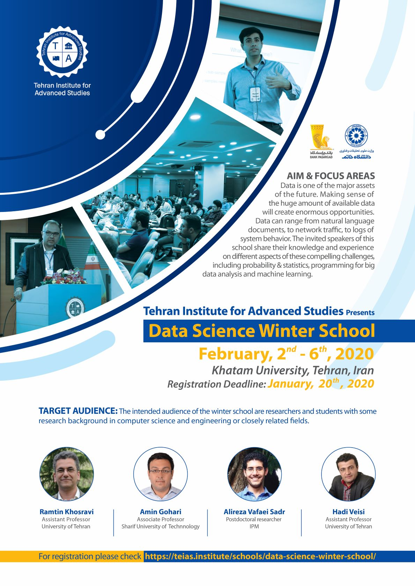

# TeIAS-2020
Tehran Institute for Advanced Studies - Data Science Winter School - 2020

    

- [data_visualization](https://github.com/vafaei-ar/TeIAS-2020/blob/master/notebooks/data_visualization.ipynb) 

- [NN-intro-1.ipynb](https://github.com/vafaei-ar/TeIAS-2020/blob/master/notebooks/NN-intro-1.ipynb) 

- [NN-intro-2.ipynb](https://github.com/vafaei-ar/TeIAS-2020/blob/master/notebooks/NN-intro-2.ipynb) 

- [exercise.ipynb](https://github.com/vafaei-ar/TeIAS-2020/blob/master/notebooks/exercise.ipynb) 

Please submit your reports/notebooks [here](https://forms.gle/aKY2uytqFoH6D46y9).

